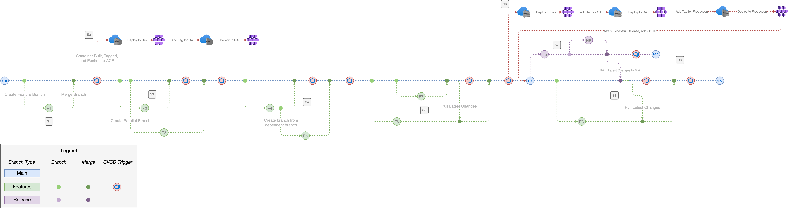
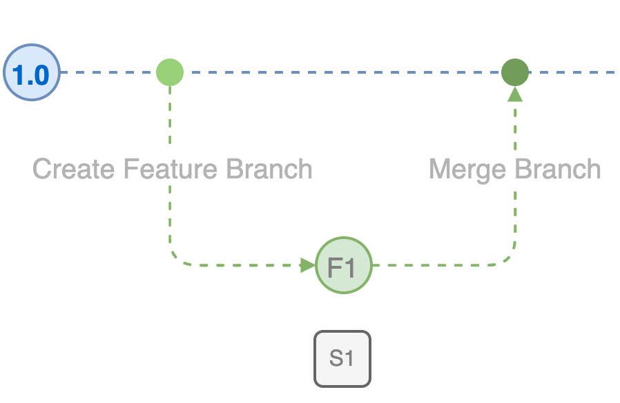
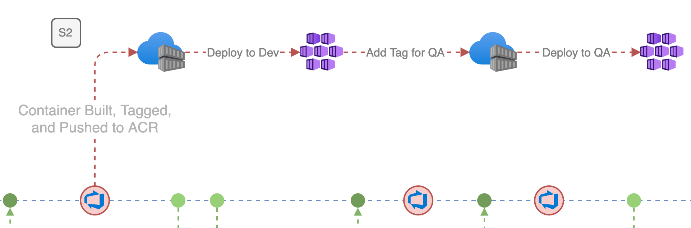
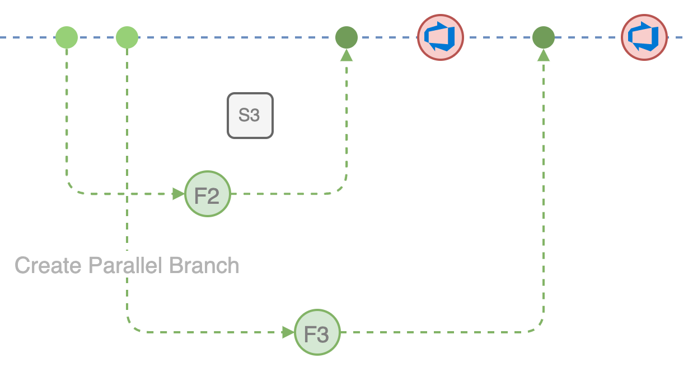
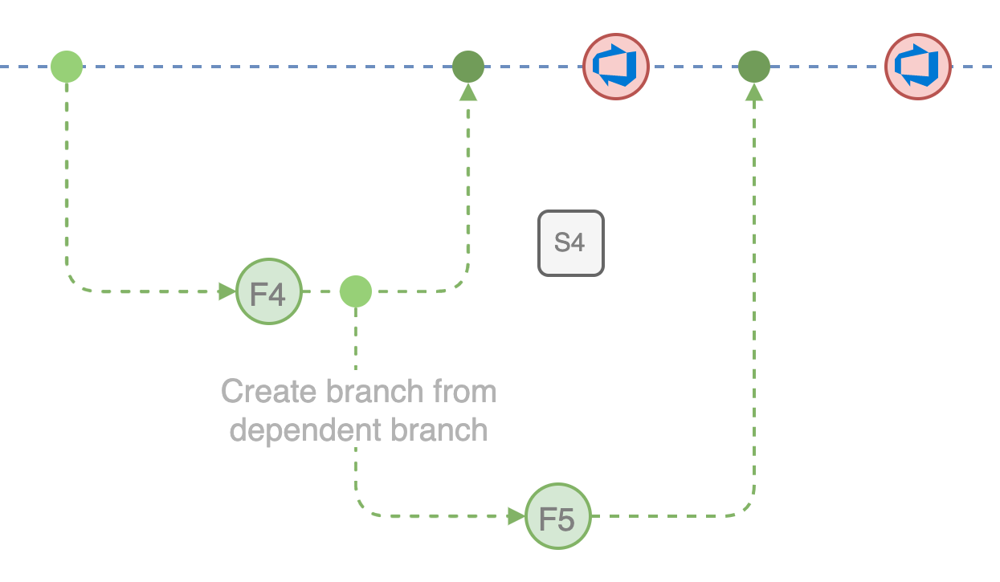
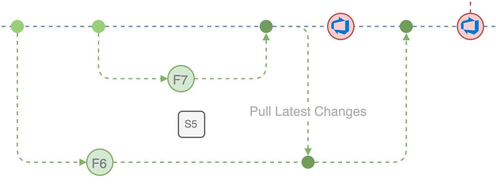
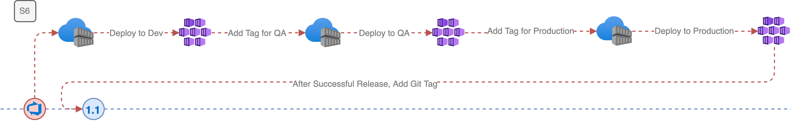
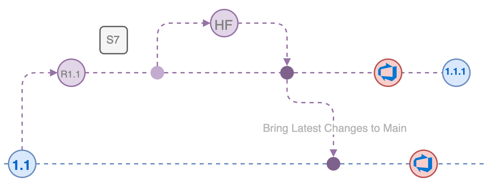
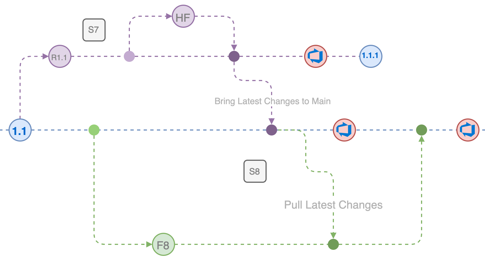
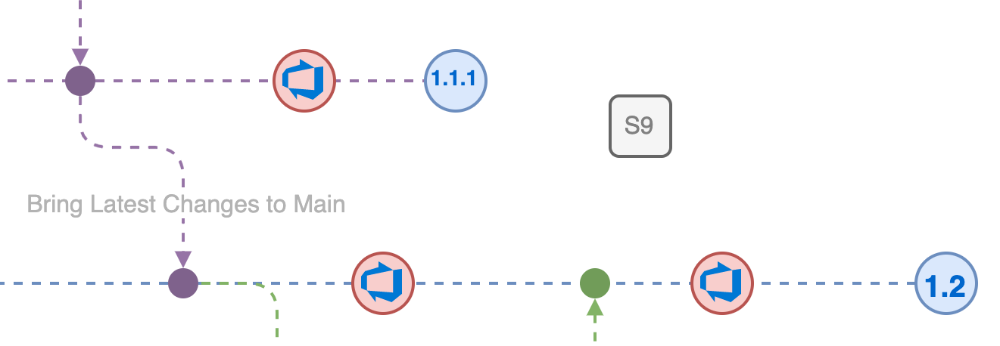

# DevOps: Release Flow Scenarios for Source Control and Deployment

An example of DevOps branching strategies based on the
[Release Flow](http://releaseflow.org) pattern.

## Release Flow with Container-based CI/CD

In this scenario, we'll examine a Release Flow-based source control strategy
that ultimately deploys its application to a container-based platform — such as
[Azure Container Registry](https://azure.microsoft.com/products/container-registry/)
for the container registry and
[Azure Kubernetes Service](https://azure.microsoft.com/products/kubernetes-service/)
for the container orchestrator.

Here we can send the end-to-end flow (click for a larger view).

Let's examine the scenarios in more detail.

### Scenario 1: Basic Branching

In the simplest form, we create a
[branch](https://git-scm.com/book/en/v2/Git-Branching-Basic-Branching-and-Merging)
from `main` to work on a new feature.

When completed,
[merge](https://git-scm.com/book/en/v2/Git-Tools-Advanced-Merging) the feature
back to the `main` branch.

### Scenario 2: CI/CD Triggering and Environment Promotion

With a CI/CD pipeline configured to automatically integrate and deliver your
source code into tangible assets, commits and merges on the `main` branch will
generate a new release process to start.

With a "build once, release everywhere" type strategy, the same artifacts that
are generated from the build pipeline would be released to future environments,
assuming that all tests and certifications have passed.

When "promoting" the artifact from one environment to another (e.g., Dev to QA),
this would be handled by a DevOps pipeline. This can be done by apply a new tag
to the existing container (e.g., the current `dev` tagged container image would
now have a `qa` tag also applied to it), or if following a versioned container
approach the destination infrastructure would be updated to pull that new tag.

### Scenario 3: Parallel Development with Branches

Multiple feature branches can be developed concurrently, and then merged back
into `main`. Simply branch off the `main` branch for both features and work in
your isolated branch.

When a merge back to `main` occurs, each feature would trigger a CI/CD pipeline
to kick off and execute. To better handle _when_ a merge to `main` occurs,
consider utilizing a Pull Request (PR) process to gate the merge, allowing for
human intervention. This is also a great time to apply any PR policies, such as
code reviews, automated builds and test runs, and other checks.

### Scenario 4: Branching from a Dependent Feature

If a feature is started that will be the foundation of another feature, a branch
can be created off the existing feature branch. For example, if you are building
a new management screen for your application that relies on an API endpoint
existing, the API feature can be branched off `main`, with the UI feature being
branched off the API feature branch.

Merges can happen back-and-forth between these branches as required. So if a new
API revision is completed, but the UI feature developer needs those changes
before they go to main, the API branch can be merged back to the UI branch.

### Scenario 5: Staying Up-to-Date with `main`

As features continue to be developed, `main` may outpace your current feature
branch. To stay up-to-date, you can merge `main` back into your feature branch.

Staying up-to-date in your branch will help reduce merge conflicts when your
feature is completed and ready to go back to `main`.

### Scenario 6: Tagging `main` After a Successful Production Release

Once a release has made it through your dev/test environments and finally
released to production, create a
[git tag](https://git-scm.com/book/en/v2/Git-Basics-Tagging) on the `main`
branch to mark the release.

This will be the foundation for creating a full release branch in the future if
a hotfix is required to the live production environment.

### Scenario 7: Creating a Hotfix for a Release

If a hotfix is required after a release has gone to production, create a branch
from your git tag. From here, you can make hotfix branches to work on any issues
or bugs in production. This should also be setup with a CI/CD process, whether
automated or manually invoked, so that minor releases can be deployed to
production.

As hotfixes are created, they can be merged back to `main` to fix the issue
there, as well. Additionally, when a deployment to production has been
completed, add a new tag to the release branch marking the minor release.

### Scenario 8: Staying Up-to-Date with `main` After a Hotfix

Just like with normal `main` development, if a hotfix is released to `main`,
pull that change into your feature branches as is convenient.

### Scenario 9: Release End-of-Life

When a release has been fully retired, the branches can be removed from the git
tree, or kept for historical purposes. Ongoing development will create new
releases and continue the process.

